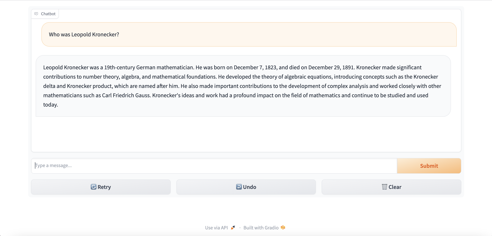

# Local chatbot development with a Python front and back end

This is a simple 'hello world' Python setup for developing chatbots locally on your machine. It is all Python - no JavaScript. It streams responses by default, i.e. word by word.

- The backend runs locally as a [FastAPI](https://fastapi.tiangolo.com/) Python web server.
- The frontend runs locally in the browser using the Python library [Gradio](https://www.gradio.app/guides/quickstart).
- The AI uses [OpenAI](https://platform.openai.com/docs/quickstart?context=python) and requires an OpenAI api key as an env variable.

It is designed to emulate chatbots which could be deployed to e.g., AWS Lambda streaming functions with Function URLs, but it could also work if deployed on many common cloud web servers.

## OpenAI API key

This project requires an OpenAI API key to use the OpenAI large language model (LLM) for generating chatbot responses. You should set the OpenAI API key as an environment variable in the terminal that runs the backend as below (change the fake code to your key):

```
export OPENAI_API_KEY=12345678abcdefg
```

## Setting up

This project is set up like a standard Python project. To create the virtualenv it assumes that there is a `python3` (or `python` for Windows) executable in your path with access to the `venv` package.

To manually create a virtualenv on MacOS and Linux:

```
$ python3 -m venv .venv
```

After the init process completes and the virtualenv is created, you can use the following
step to activate your virtualenv.

```
$ source .venv/bin/activate
```

If you are a Windows platform, you would activate the virtualenv like this:

```
% .venv\Scripts\activate.bat
```

Once the virtualenv is activated, you can install the required dependencies.

```
$ pip install -r requirements.txt
```

To add additional dependencies, for example other python libraries, just add
them to your `requirements.txt` file and rerun the `pip install -r requirements.txt`
command.

## Running the backend and frontend on your machine

To run the app in VS Code, create a split terminal so you can run two things at once and activate the venv in both as described above. Both the frontend and backends need to be running to use the chatbot.

### Running the backend

To run the backend in one of the terminals, change directory at the terminal into the `backend` directory and run the uvicorn comand below which will start the FastAPI backend server which runs the chatbot logic and will call out to OpenAI. The `--reload` option enables FastAPI to automatically reload changes as you develop:

```
uvicorn main:app --reload
```

The backend will be running on port 8000 and you will find auto generated swagger documentation for your backend API at http://localhost:8000/docs in the browser when the app is running.

### Running the frontend

To run the frontend in the other terminal, change directory into the `frontend` directory and run the command:

```
python app.y
```

This will start the frontend and provide a link in the terminal which you can click or paste into the browser to use the gradio UI for the chatbot. The file `app.y` in the frontend directory receives the inputs from the UI and makes requests to the backend FastAPI endpoints, which in turn call OpenAI before returning the response back to the UI, thus emulating the front and backend parts of a conventional web application.

When both the front and backends are running you should see the UI in the browser looking something like this:



## How would this be deployed?

The backend FastAPI project could either be hosted on any conventional cloud server or in an AWS Lambda function using the Lambda Web Adapter and a Function URL to enable streaming responses, i.e. seeing each word appear in the UI as it becomes available. Any logic that needs to be written to develop bespoke capabilities should be done in the backend project. Significant code development and customisation should _not_ happen in the app.py file in the frontend directory as this is a temporary development UI and would be replaced by a JavaScript based frontend in a real web app.
